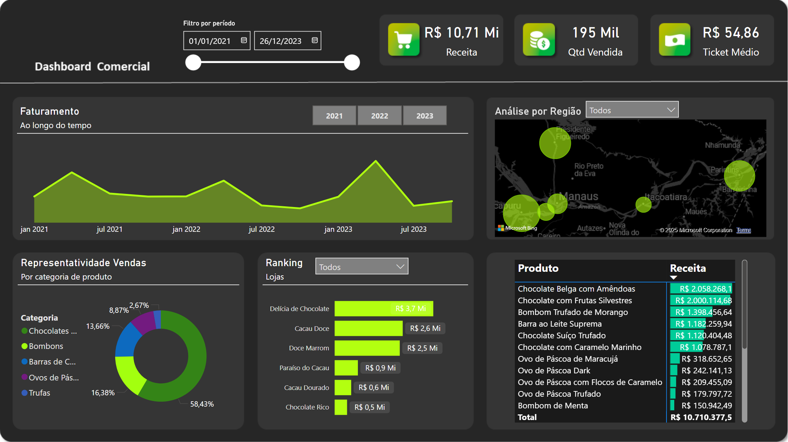

# 🏪 Dashboard Comercial
Criado para testes e treinar a ferramenta. 

Relatório Comercial, planilha mais detalhada, com variedade de filtros e utilidades.

## 📊 Gráficos
- Faturamento ao longo do tempo;
- Ranking de Lojas;
- Análise por região;
- Receita;
- Quantidade Vendidade;
- Representatividade de Vendas;
- Ticket Médio.

Contém botões de atalho para filtrar períodos, além de filtros mais inteligentes e amplos para cada modalidade. Possui um mapa que mostra o faturamento de cada Estado.

***

[__➡️ Clique aqui para visualizar na prática ⬅️__](https://app.powerbi.com/view?r=eyJrIjoiMDUxMjMwM2UtMzQ3NC00MmJkLTg0YWMtYzJmMjA2YzExOTFmIiwidCI6IjAwZDE0NDU5LTRiOTMtNDI5Ny04ZjViLTVhYmUyMDQwNGUxOSJ9)

***
Exemplo:
